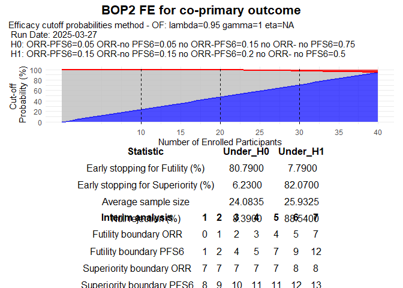
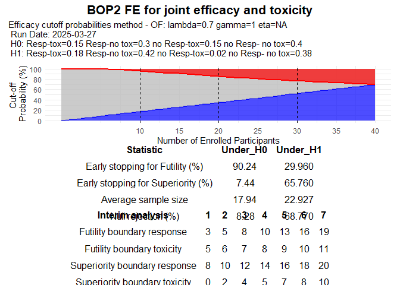

<!-- README.md is generated from README.Rmd. Please edit that file -->

# BOP2-FE

<!-- badges: start -->
<!-- badges: end -->

The primary purpose of an oncology single-arm trial is to evaluate the
effectiveness of anticancer agents and make a go / no-go decision while
maintaining patient safety. This R-package implements a flexible
Bayesian optimal phase II design with futility and efficacy stopping
boundaries for single-arm clinical trials, named the BOP2-FE design,
proposed by Xu et al (under review). The proposed BOP2-FE design allows
for early stopping of efficacy when the observed antitumor effect is
sufficiently higher than the null hypothesis value in the interim looks
and retains the benefits of the original BOP2 design, such as explicitly
controlling the type I error rate while maximizing power, accommodating
different types of endpoint, flexible number of interim looks, and
stopping boundaries calculated before the start of the trial. The
package handles multiple endpoints including binary, nested, co-primary
and joint efficacy and toxicity.

## Installation

You can install the development version of BOP2FE from
[GitHub](https://github.com/) with:

``` r
# install.packages("pak")
pak::pak("belayb/BOP2FE")
```

## Example

This is a basic example which shows you how to use BOP2FE:

``` r
library(BOP2FE)
## basic example code
```

### Binary endpoint

``` r
BOP2FE_binary(H0 =0.2, n = c(10,5,5,5,5,5,5), lambda = 0.909, gamma=1, nsim = 10000, seed = 1234)
```


### Nested endpoint

``` r
BOP2FE_nested(CR0 = 0.15, CRPR0 = 0.30, n=c(10,5,5,5,5,5,5), lambda = 0.95, gamma=1, seed = 123)
```


### Co-primary endpoint

``` r
BOP2FE_coprimary(H0 = c(0.05,0.05,0.15,0.75), n=c(10,5,5,5,5,5,5), lambda = 0.95, gamma=1,seed = 123)
```



### Joint endpoint

``` r
BOP2FE_jointefftox(H0 = c(0.15, 0.30, 0.15, 0.40), n=c(10,5,5,5,5,5,5), lambda = 0.7, gamma=1, seed = 123)
```



### Optimizing Design Parameters

The operating characteristics of the BOP2-FE design with futility and
efficacy stopping rules depend on the specification of the probability
cutoffs for futility and efficacy. To maximize statistical power while
controlling the type I error rate at a certain prespecified level, the
tuning parameters, (lambda, gamma, eta) when using the power function
for the probability cutoffs for efficacy, and (lambda, gamma) when using
the O’Brien-Fleming type function for the probability cutoffs for
efficacy, should be identified through simulation as follows.

``` r
Sim_res <- Optimal_pars_nested(CR0=0.15, CRPR0=0.30, CR1=0.25, CRPR1=0.50, n=c(20,10,10), nsim=1000, t1e=0.1, t2e=0.2, method="power",
                                lambda1=0.85, lambda2=1, grid1=5, gamma1=0.9, gamma2=1.1, grid2=5, eta1=0.9, eta2=1.1, grid3=5)
#>   |                                                                              |                                                                      |   0%  |                                                                              |=                                                                     |   1%  |                                                                              |=                                                                     |   2%  |                                                                              |==                                                                    |   2%  |                                                                              |==                                                                    |   3%  |                                                                              |===                                                                   |   4%  |                                                                              |===                                                                   |   5%  |                                                                              |====                                                                  |   5%  |                                                                              |====                                                                  |   6%  |                                                                              |=====                                                                 |   6%  |                                                                              |=====                                                                 |   7%  |                                                                              |======                                                                |   8%  |                                                                              |======                                                                |   9%  |                                                                              |=======                                                               |  10%  |                                                                              |=======                                                               |  11%  |                                                                              |========                                                              |  11%  |                                                                              |========                                                              |  12%  |                                                                              |=========                                                             |  12%  |                                                                              |=========                                                             |  13%  |                                                                              |==========                                                            |  14%  |                                                                              |==========                                                            |  15%  |                                                                              |===========                                                           |  15%  |                                                                              |===========                                                           |  16%  |                                                                              |============                                                          |  17%  |                                                                              |============                                                          |  18%  |                                                                              |=============                                                         |  18%  |                                                                              |=============                                                         |  19%  |                                                                              |==============                                                        |  19%  |                                                                              |==============                                                        |  20%  |                                                                              |===============                                                       |  21%  |                                                                              |===============                                                       |  22%  |                                                                              |================                                                      |  22%  |                                                                              |================                                                      |  23%  |                                                                              |=================                                                     |  24%  |                                                                              |=================                                                     |  25%  |                                                                              |==================                                                    |  25%  |                                                                              |==================                                                    |  26%  |                                                                              |===================                                                   |  27%  |                                                                              |===================                                                   |  28%  |                                                                              |====================                                                  |  28%  |                                                                              |====================                                                  |  29%  |                                                                              |=====================                                                 |  30%  |                                                                              |=====================                                                 |  31%  |                                                                              |======================                                                |  31%  |                                                                              |======================                                                |  32%  |                                                                              |=======================                                               |  32%  |                                                                              |=======================                                               |  33%  |                                                                              |========================                                              |  34%  |                                                                              |========================                                              |  35%  |                                                                              |=========================                                             |  35%  |                                                                              |=========================                                             |  36%  |                                                                              |==========================                                            |  37%  |                                                                              |==========================                                            |  38%  |                                                                              |===========================                                           |  38%  |                                                                              |===========================                                           |  39%  |                                                                              |============================                                          |  39%  |                                                                              |============================                                          |  40%  |                                                                              |=============================                                         |  41%  |                                                                              |=============================                                         |  42%  |                                                                              |==============================                                        |  43%  |                                                                              |==============================                                        |  44%  |                                                                              |===============================                                       |  44%  |                                                                              |===============================                                       |  45%  |                                                                              |================================                                      |  45%  |                                                                              |================================                                      |  46%  |                                                                              |=================================                                     |  47%  |                                                                              |=================================                                     |  48%  |                                                                              |==================================                                    |  48%  |                                                                              |==================================                                    |  49%  |                                                                              |===================================                                   |  50%  |                                                                              |====================================                                  |  51%  |                                                                              |====================================                                  |  52%  |                                                                              |=====================================                                 |  52%  |                                                                              |=====================================                                 |  53%  |                                                                              |======================================                                |  54%  |                                                                              |======================================                                |  55%  |                                                                              |=======================================                               |  55%  |                                                                              |=======================================                               |  56%  |                                                                              |========================================                              |  56%  |                                                                              |========================================                              |  57%  |                                                                              |=========================================                             |  58%  |                                                                              |=========================================                             |  59%  |                                                                              |==========================================                            |  60%  |                                                                              |==========================================                            |  61%  |                                                                              |===========================================                           |  61%  |                                                                              |===========================================                           |  62%  |                                                                              |============================================                          |  62%  |                                                                              |============================================                          |  63%  |                                                                              |=============================================                         |  64%  |                                                                              |=============================================                         |  65%  |                                                                              |==============================================                        |  65%  |                                                                              |==============================================                        |  66%  |                                                                              |===============================================                       |  67%  |                                                                              |===============================================                       |  68%  |                                                                              |================================================                      |  68%  |                                                                              |================================================                      |  69%  |                                                                              |=================================================                     |  69%  |                                                                              |=================================================                     |  70%  |                                                                              |==================================================                    |  71%  |                                                                              |==================================================                    |  72%  |                                                                              |===================================================                   |  72%  |                                                                              |===================================================                   |  73%  |                                                                              |====================================================                  |  74%  |                                                                              |====================================================                  |  75%  |                                                                              |=====================================================                 |  75%  |                                                                              |=====================================================                 |  76%  |                                                                              |======================================================                |  77%  |                                                                              |======================================================                |  78%  |                                                                              |=======================================================               |  78%  |                                                                              |=======================================================               |  79%  |                                                                              |========================================================              |  80%  |                                                                              |========================================================              |  81%  |                                                                              |=========================================================             |  81%  |                                                                              |=========================================================             |  82%  |                                                                              |==========================================================            |  82%  |                                                                              |==========================================================            |  83%  |                                                                              |===========================================================           |  84%  |                                                                              |===========================================================           |  85%  |                                                                              |============================================================          |  85%  |                                                                              |============================================================          |  86%  |                                                                              |=============================================================         |  87%  |                                                                              |=============================================================         |  88%  |                                                                              |==============================================================        |  88%  |                                                                              |==============================================================        |  89%  |                                                                              |===============================================================       |  89%  |                                                                              |===============================================================       |  90%  |                                                                              |================================================================      |  91%  |                                                                              |================================================================      |  92%  |                                                                              |=================================================================     |  93%  |                                                                              |=================================================================     |  94%  |                                                                              |==================================================================    |  94%  |                                                                              |==================================================================    |  95%  |                                                                              |===================================================================   |  95%  |                                                                              |===================================================================   |  96%  |                                                                              |====================================================================  |  97%  |                                                                              |====================================================================  |  98%  |                                                                              |===================================================================== |  98%  |                                                                              |===================================================================== |  99%  |                                                                              |======================================================================| 100%

head(Sim_res)
#> # A tibble: 6 × 7
#>   H0         H1         Lambda Gamma   eta reject_mean power_mean
#>   <chr>      <chr>       <dbl> <dbl> <dbl>       <dbl>      <dbl>
#> 1 0.15, 0.15 0.25, 0.25   0.91  1.06  0.9        0.099      0.868
#> 2 0.15, 0.15 0.25, 0.25   0.91  1.06  0.94       0.099      0.868
#> 3 0.15, 0.15 0.25, 0.25   0.91  1.06  0.98       0.099      0.868
#> 4 0.15, 0.15 0.25, 0.25   0.91  1.06  1.02       0.099      0.868
#> 5 0.15, 0.15 0.25, 0.25   0.91  1.06  1.06       0.099      0.868
#> 6 0.15, 0.15 0.25, 0.25   0.91  1.06  1.1        0.099      0.868
```
