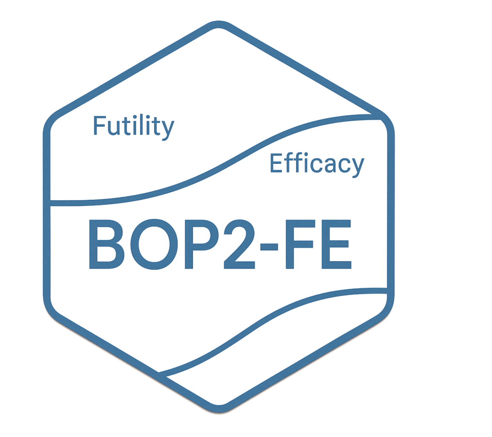

<!-- README.md is generated from README.Rmd. Please edit that file -->

# BOP2-FE 

<!-- badges: start -->

[](https://github.com/belayb/BOP2FE/actions/workflows/R-CMD-check.yaml)
[](https://app.codecov.io/gh/belayb/BOP2FE)
<!-- badges: end -->

This R-package implements a flexible Bayesian optimal phase II design
with futility and efficacy stopping boundaries for single-arm clinical
trials, named the BOP2-FE design, proposed by Xu et al. (2025). The
proposed BOP2-FE design allows for early stopping of efficacy when the
observed antitumor effect is sufficiently higher than the null
hypothesis value in the interim looks and retains the benefits of the
original BOP2 design, such as explicitly controlling the type I error
rate while maximizing power, accommodating different types of endpoint,
flexible number of interim looks, and stopping boundaries calculated
before the start of the trial. The package handles multiple endpoints
including binary, nested, co-primary and joint efficacy and toxicity.

## Installation

You can install the development version of BOP2FE from
[GitHub](https://github.com/) with:

``` r
# install.packages("pak")
pak::pak("belayb/BOP2FE")
```

## Example

This is a basic example which shows you how to use BOP2FE:

``` r
library(BOP2FE)
```

### Binary endpoint

``` r
test_binary <- BOP2FE_binary(
 H0=0.2, H1= 0.4,
 n = c(10, 5, 5, 5, 5, 5, 5),
 nsim = 1000, t1e = 0.1, method = "power",
 lambda1 = 0, lambda2 = 1, grid1 = 11,
 gamma1 = 0, gamma2 = 1, grid2 = 11,
 eta1 = 0, eta2 = 3, grid3 = 31,
 seed = 123
)
summary(test_binary)
#> $design_pars
#> $design_pars$H0
#> [1] 0.2
#> 
#> $design_pars$H1
#> [1] 0.4
#> 
#> $design_pars$n
#> [1] 10  5  5  5  5  5  5
#> 
#> $design_pars$cum_n
#> [1] 10 15 20 25 30 35 40
#> 
#> $design_pars$nsim
#> [1] 1000
#> 
#> $design_pars$t1e
#> [1] 0.1
#> 
#> $design_pars$method
#> [1] "power"
#> 
#> 
#> $opt_pars
#>   lambda gamma eta
#> 1    0.9     1 2.1
#> 
#> $boundary
#>                   IA1 IA2 IA3 IA4 IA5 IA6 FA
#> Futility boundary   1   2   3   5   7   9 11
#> Efficacy boundary   6   8   9  10  10  11 12
#> 
#> $oc
#>                         Under H0 Under H1
#> Early stop for futility    0.870    0.105
#> Early stop for efficacy    0.086    0.858
#> Average sample size       20.060   22.640
#> Reject null                0.095    0.883
```

The result of BOP2-FE can be visualized as follow

``` r
plot(test_binary)
```


### Nested endpoint

``` r
test_nested <- BOP2FE_nested(
 H0=c(0.15,0.15, 0.70), H1= c(0.25,0.25, 0.50),
 n = c(10, 5, 5, 5, 5, 5, 5),
 nsim = 1000, t1e = 0.1, method = "power",
 lambda1 = 0, lambda2 = 1, grid1 = 11,
 gamma1 = 0, gamma2 = 1, grid2 = 11,
 eta1 = 0, eta2 = 3, grid3 = 31,
 seed = 123
)
summary(test_nested)
#> $design_pars
#> $design_pars$H0
#> [1] 0.15 0.15 0.70
#> 
#> $design_pars$H1
#> [1] 0.25 0.25 0.50
#> 
#> $design_pars$n
#> [1] 10  5  5  5  5  5  5
#> 
#> $design_pars$cum_n
#> [1] 10 15 20 25 30 35 40
#> 
#> $design_pars$nsim
#> [1] 1000
#> 
#> $design_pars$t1e
#> [1] 0.1
#> 
#> $design_pars$method
#> [1] "power"
#> 
#> 
#> $opt_pars
#>   lambda gamma eta
#> 1    0.9   0.3   2
#> 
#> $boundary
#>                           IA1 IA2 IA3 IA4 IA5 IA6 FA
#> Futility boundary (CR)      1   3   4   5   6   7  9
#> Futility boundary (CR/PR)   3   5   7   9  11  13 15
#> Efficacy boundary (CR)      6   6   7   8   9   9 10
#> Efficacy boundary (CR/PR)   8   9  11  12  14  15 16
#> 
#> $oc
#>                         Under H0 Under H1
#> Early stop for futility    0.887    0.219
#> Early stop for efficacy    0.088    0.763
#> Average sample size       15.915   19.415
#> Reject null                0.098    0.778
```

### Co-primary endpoint

``` r
test_coprimary <- BOP2FE_coprimary(
 H0=c(0.05,0.05, 0.15, 0.75),
 H1= c(0.15,0.15, 0.20, 0.50),
 n = c(10, 5, 5, 5, 5, 5, 5),
 nsim = 1000, t1e = 0.1, method = "power",
 lambda1 = 0, lambda2 = 1, grid1 = 11,
 gamma1 = 0, gamma2 = 1, grid2 = 11,
 eta1 = 0, eta2 = 3, grid3 = 31,
 seed = 123
)
summary(test_coprimary)
#> $design_pars
#> $design_pars$H0
#> [1] 0.05 0.05 0.15 0.75
#> 
#> $design_pars$H1
#> [1] 0.15 0.15 0.20 0.50
#> 
#> $design_pars$n
#> [1] 10  5  5  5  5  5  5
#> 
#> $design_pars$cum_n
#> [1] 10 15 20 25 30 35 40
#> 
#> $design_pars$nsim
#> [1] 1000
#> 
#> $design_pars$t1e
#> [1] 0.1
#> 
#> $design_pars$method
#> [1] "power"
#> 
#> 
#> $opt_pars
#>   lambda gamma eta
#> 1    0.9   0.3 2.3
#> 
#> $boundary
#>                          IA1 IA2 IA3 IA4 IA5 IA6 FA
#> Futility boundary (OR)     1   2   3   4   4   5  6
#> Futility boundary (PFS6)   2   3   5   6   8   9 11
#> Efficacy boundary (OR)     5   6   6   6   7   7  7
#> Efficacy boundary (PFS6)   7   8   9  10  11  11 12
#> 
#> $oc
#>                         Under H0 Under H1
#> Early stop for futility    0.880    0.096
#> Early stop for efficacy    0.084    0.899
#> Average sample size       16.285   18.710
#> Reject null                0.098    0.902
#plot(test_coprimary)
```

### Joint endpoint

``` r
test_joint <- BOP2FE_jointefftox(
 H0=c(0.15,0.30, 0.15, 0.40),
 H1= c(0.18,0.42, 0.02, 0.38),
 n = c(10, 5, 5, 5, 5, 5, 5),
 nsim = 1000, t1e = 0.1, method = "power",
 lambda1 = 0, lambda2 = 1, grid1 = 11,
 gamma1 = 0, gamma2 = 1, grid2 = 11,
 eta1 = 0, eta2 = 3, grid3 = 31,
 seed = 123
)
summary(test_joint)
#> $design_pars
#> $design_pars$H0
#> [1] 0.15 0.30 0.15 0.40
#> 
#> $design_pars$H1
#> [1] 0.18 0.42 0.02 0.38
#> 
#> $design_pars$n
#> [1] 10  5  5  5  5  5  5
#> 
#> $design_pars$cum_n
#> [1] 10 15 20 25 30 35 40
#> 
#> $design_pars$nsim
#> [1] 1000
#> 
#> $design_pars$t1e
#> [1] 0.1
#> 
#> $design_pars$method
#> [1] "power"
#> 
#> 
#> $opt_pars
#>   lambda gamma eta
#> 1    0.7   0.8 0.9
#> 
#> $boundary
#>                         IA1 IA2 IA3 IA4 IA5 IA6 FA
#> Futility boundary (OR)    3   5   8  11  13  16 19
#> Futility boundary (Tox)   5   6   7   8   9  10 11
#> Efficacy boundary (OR)    7  10  12  14  16  18 20
#> Efficacy boundary (Tox)   1   2   4   5   7   8 10
#> 
#> $oc
#>                         Under H0 Under H1
#> Early stop for futility    0.886    0.311
#> Early stop for efficacy    0.094    0.646
#> Average sample size       18.020   22.085
#> Reject null                0.099    0.676
#plot(test_joint)
```
